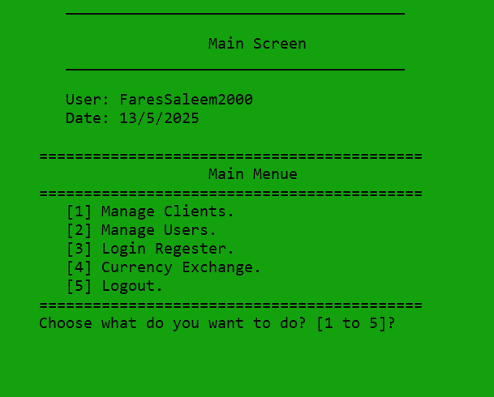
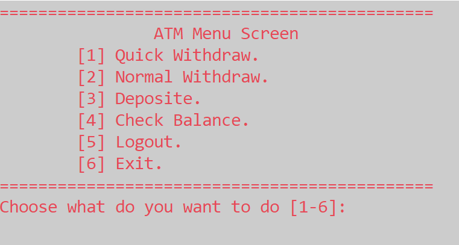
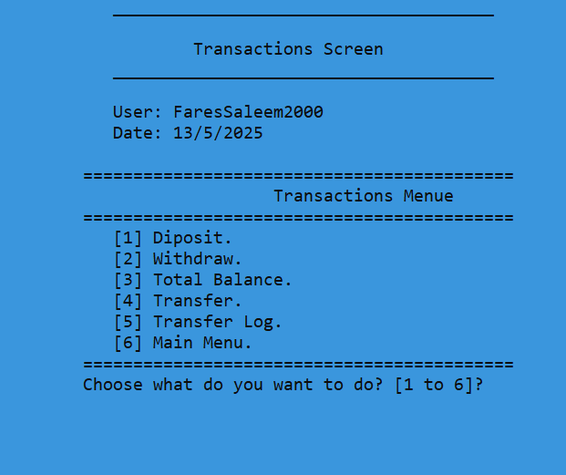
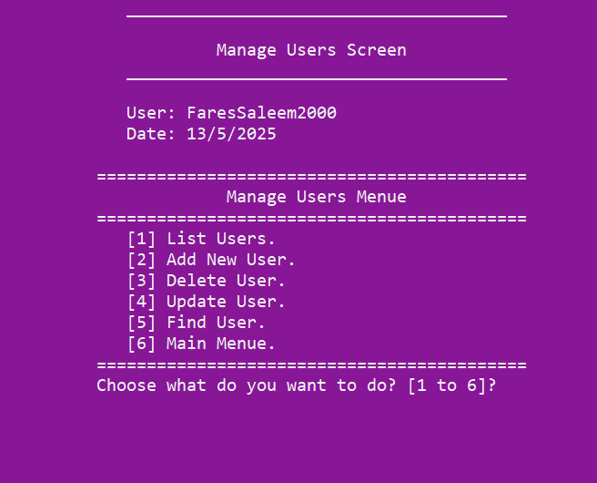
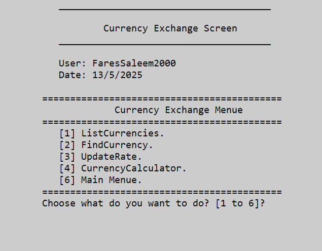

# 🏦 Bank Management System 
 

A cleanly structured, object-oriented C++ console application for managing bank clients, users, and transactions with file-based data persistence.

---

## 📖 Description
A fully functional **console-based Bank Management System** developed in modern C++. This project demonstrates real-world OOP concepts, file-based data persistence, layered UI abstraction, and clean modular design. It provides tools for managing clients, users, transactions, and system activity logs securely and efficiently.

---

## 🚀 Features
- 🔐 **Login System**
  - User authentication
  - Role-based access
- 👤 **Client Management**
  - Add, update, delete, and find clients
  - Track balances and account numbers
- 👥 **User Management**
  - Add/update/delete system users
  - Manage permissions and audit logs
- 💵 **Transaction Module**
  - Deposit, Withdraw, and Transfer
  - Auto-update of balances
  - Transaction history logging
- 📜 **Login Register**
  - View user login activity with timestamps
- 📁 **Persistent Storage**
  - All data saved in local `.txt` files
  - File paths organized per module

---

### 🧠 Key Programming Techniques

- Object-Oriented Programming (OOP)
- Inheritance & Polymorphism
- Interface classes with pure virtual functions
- Template functions and classes
- File-based data persistence using `.txt` files
- Static and global variable management
- Modular folder and code structure (SRP)
- Enum-based state and control flow
- Console UI design and screen color control
- Input validation utilities
- Simulated properties (`__declspec(property)`)

---

## 🛠️ Technologies Used

- C++17
- Object-Oriented Programming
- File I/O using `fstream`
- Static members and global data
- Console UI formatting
- `enum`, `struct`, templates, inheritance

---

## 📁 Project Structure
Bank-Management-System/
├── core/ # Business logic classes (clsClient, clsUser, ...)
├── screens/ # Application UI screens (clsMainMenuScreen, etc.)
├── interfaces/ # Pure virtual interfaces (e.g., ICommunication)
├── utils/ # Helpers (clsInputValidate, clsConsoleInput, ...)
├── data/ # Persistent text files (Clients.txt, Users.txt, ...)
├── src/ # Entry point (main.cpp)
├── Global.h / .cpp # Global shared data (CurrentUser, file paths)

---

## 🛠️ Built With
- 💻 C++ (Console Application)
- 📂 File Handling (using `.txt` files)
- 🧩 OOP Principles (structs, enums)
- 🖥️ Simple CLI Interface (text-based)

---

## 📱 App Demo

Here’s a quick preview of the app in action:
### 🖼️ Image Preview

### 🎥 Video Demo
- [▶️ Click to watch Bank demo](https://youtu.be/dmFUZuipN6w)

---
 
## 👤 Author
Written with passion by **[@FaresSaleemGHub](https://github.com/FaresSaleemGHub)**

---

## 📜 License
This project is open-source and available under the [MIT License](LICENSE).
