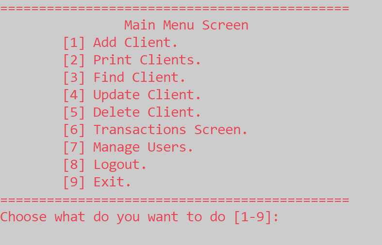

# 🛵 Bank Management System & ATM System
 
A C++ console application combining a Bank Management System and ATM Simulation. It allows users to manage accounts, perform deposits, withdrawals, balance checks, and simulate ATM operations through an interactive text-based interface.

---

## 📄 Description
This project consists of two connected C++ console applications:
Bank Management System:
A desktop admin program that allows the bank staff to manage clients' accounts and users.
Admins can add, update, delete, search for clients, perform transactions, and manage system users with specific permissions.

ATM System:
A client-side program that allows account holders to log in, withdraw money, deposit, and check their account balance through a simple ATM interface.
Both systems work on the same data files, ensuring real-time updates.

---

## 🚀 Features:
Bank Management System:
Secure login system with user permissions.
Add, update, delete, and find clients.
Perform deposit and withdrawal operations.
View total balances across all clients.
Manage users (bank employees) and set their permissions.
Save and load client/user data from external .txt files.

ATM System:
Secure client login (Account Number + PIN Code).
Quick withdraw (preset amounts).
Normal withdraw (custom amounts multiple of 5).
Deposit amounts into the account.
Check current account balance.
Save updates immediately to the shared client data file.

---

## 🛠️ Built With:
C++ (Console Application)
File Handling (using .txt files)
OOP Principles (structs, enums)
Simple CLI Interface (text-based)

---

## 📢 Notes:
This is a standalone C++ console project — no external libraries required except for built-in ones (iostream, fstream, vector, etc.).
Designed mainly for learning purposes: file handling, user authentication, simple banking operations simulation.
In real-world applications, data security and encryption would be essential for handling sensitive information like PIN codes and balances.

---

## 📱 App Demo
Here’s a quick preview of the app in action:
### 🖼️ Image Preview

### 🎥 Video Demo
[▶️ Click to watch Bank demo](https://www.youtube.com/watch?v=6ks9KF9YUNs)
[▶️ Click to watch ATM demo](https://www.youtube.com/watch?v=qF0Fm44vxqw)

---

## 👤 Author
Written with passion by – @FaresSaleemGHub

---

## 📜 License
This project is open-source and available under the MIT License.
